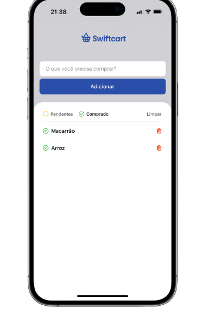

# 🛒 Swift Cart

Swift Cart is a simple shopping list app built with React Native and Expo. It allows you to add, filter, mark as purchased, and remove items from your shopping list in a practical and intuitive way.



## ✨ Features

- ✍️ **Add items**: Enter the product name and add it to your list.
- 🟡 **Filter by status**: View **pending** or **purchased** items with just one tap.
- ✅ **Mark as purchased**: Change the item status to indicate it has been bought.
- 🗑️ **Remove items**: Delete items individually or clear the entire list.
- 💾 **Local persistence**: All data is saved on the device using AsyncStorage.

## 📱 Layout

The app features a simple and intuitive interface, with visual icons for item status:

- 🟠 **Pending**: Items not yet purchased.
- 🟢 **Purchased**: Items already bought.
- 🗑️ **Trash**: Easily remove items.

## 🚀 How to run

1. Clone the repository:
   ```sh
   git clone https://github.com/your-username/swift-cart.git
   ```
2. Install dependencies:
   ```sh
   npm install
   ```
3. Start the project:
   ```sh
   npm start
   ```
4. Scan the QR code with the Expo Go app on your device.

## 🛠️ Technologies

- [React Native](https://reactnative.dev/)
- [Expo](https://expo.dev/)
- [AsyncStorage](https://react-native-async-storage.github.io/async-storage/)
- [Lucide React Native](https://lucide.dev/)
